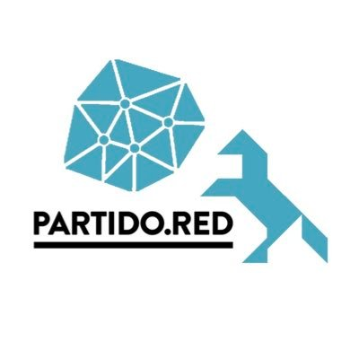

# 🤖 Agente del Partido de la Red

<div align="center">
  
</div>

## 📑 Descripción

Este es el repositorio oficial del agente de inteligencia artificial del Partido de la Red. Este agente está diseñado para facilitar la participación ciudadana y la democracia digital, ayudando a conectar a los ciudadanos con las iniciativas y propuestas políticas de manera más efectiva.

## 🎯 Objetivos

- 🗣️ Facilitar el diálogo entre ciudadanos y representantes
- 📊 Analizar y explicar propuestas políticas
- 🤝 Fomentar la participación ciudadana
- 📚 Educar sobre procesos democráticos
- 🔍 Proporcionar transparencia en la toma de decisiones

## 🚀 Comenzar

### Prerrequisitos

- [Python 2.7+](https://www.python.org/downloads/)
- [Node.js 23+](https://docs.npmjs.com/downloading-and-installing-node-js-and-npm)
- [pnpm](https://pnpm.io/installation)

### Instalación

1. Clonar el repositorio:
```bash
git clone https://github.com/DemocracyEarth/partidodelared.git
cd partidodelared
```

2. Instalar dependencias:
```bash
pnpm install
```

3. Copiar el archivo de configuración:
```bash
cp .env.example .env
```

4. Configurar las variables de entorno en el archivo `.env`

5. Construir y ejecutar:
```bash
pnpm build
pnpm start
```

## ⚙️ Configuración del Agente

El comportamiento y personalidad del agente se configura principalmente a través del archivo `partidodelared.character.ts`. Este archivo contiene:

- 🎭 La personalidad base del agente
- 💬 Los prompts y respuestas predeterminadas
- 🧠 Las instrucciones de comportamiento
- 🔗 La configuración de integración con plataformas

Para modificar el comportamiento del agente:

1. Abre el archivo `partidodelared.character.ts`
2. Modifica las propiedades relevantes:
   ```typescript
   {
     "name": "Agente Partido de la Red",
     "personality": "...",
     "instructions": "...",
     "prompts": {
       // Configura aquí los diferentes prompts
     }
   }
   ```
3. Reinicia el agente para que los cambios surtan efecto

> **Nota**: Asegúrate de mantener la coherencia en el tono y estilo de las respuestas al modificar los prompts.

## 👥 Cómo Contribuir

Nos encanta recibir contribuciones de la comunidad. Aquí hay algunas formas en las que puedes ayudar:

1. **Reportar Bugs**
   - Abre un issue describiendo el problema
   - Incluye pasos para reproducir el error
   - Menciona tu entorno (OS, versiones, etc.)

2. **Sugerir Mejoras**
   - Abre un issue con la etiqueta "enhancement"
   - Explica tu propuesta en detalle
   - Si es posible, incluye ejemplos o mockups

3. **Enviar Pull Requests**
   - Fork el repositorio
   - Crea una rama para tu feature (`git checkout -b feature/AmazingFeature`)
   - Commit tus cambios (`git commit -m 'Add some AmazingFeature'`)
   - Push a la rama (`git push origin feature/AmazingFeature`)
   - Abre un Pull Request

### Guías de Estilo

- Sigue las convenciones de código existentes
- Escribe mensajes de commit descriptivos
- Documenta cualquier nueva funcionalidad
- Añade tests cuando sea posible

## 📜 Licencia

Este proyecto está licenciado bajo la Licencia MIT - ver el archivo [LICENSE](LICENSE) para más detalles.

## 🤝 Contacto

- **Sitio Web**: [partidodelared.org](https://partidodelared.org)
- **Twitter**: [@partidodelared](https://twitter.com/partidodelared)
- **Telegram**: [partido.red](http://partido.red)

---

<div align="center">
  Hecho con ❤️ por la comunidad del Partido de la Red
</div>
